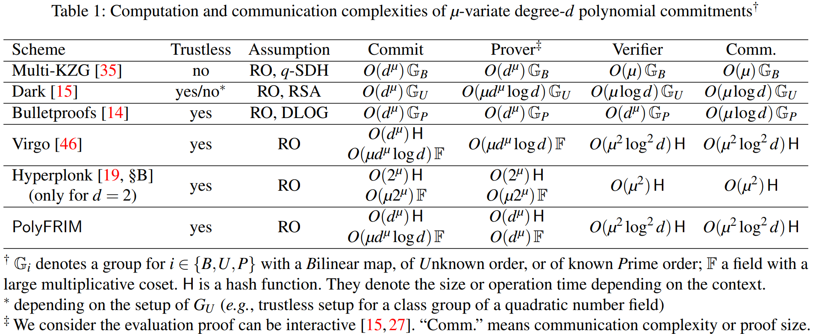
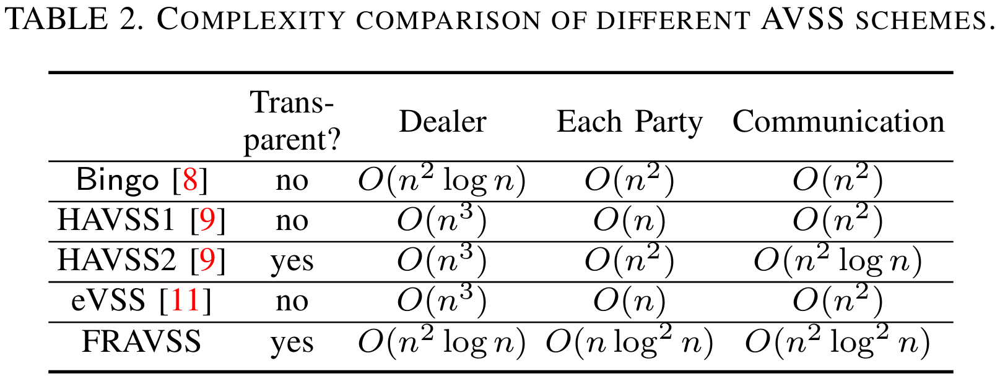
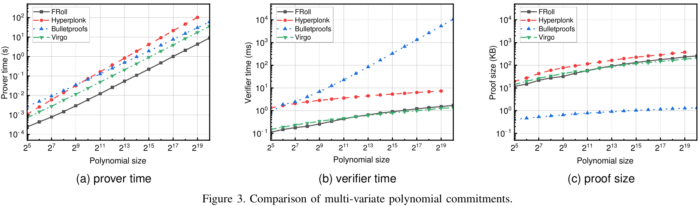
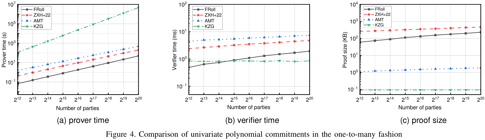
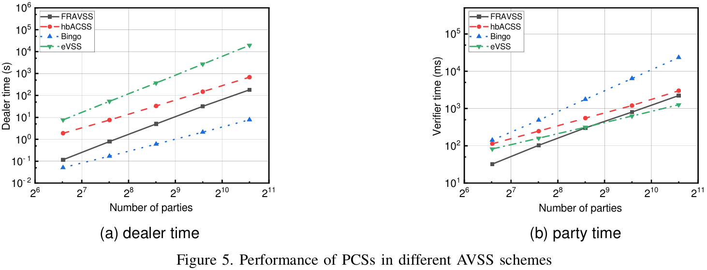

# One-to-Many Multivariate Polynomial Commitment from Fast Reed-Solomon IOPs and Its Application to Asynchronous Verifiable Secret Sharing

## Introduction and Motivation

A polynomial commitment scheme (PCS) enables a prover to commit to a polynomial $f$ defined over a field $\mathbb{F}$ with degree bound $d$ and variable number $\mu$. When given a point $\vec{x} \in \mathbb{F}^{\mu}$, the prover can convince a verifier via an evaluation proof that the committed polynomial $f$ satisfies $f(\vec{x}) = y$ for a public $y \in \mathbb{F}$.

PCSs from *Fast Reed-Solomon IOP of proximity* (FRI) stand out among succinct and efficient ones for their efficient execution and plausible post-quantum security, gaining popularity in zk-rollup, families of post-quantum signatures like Picnic, and zero-knowledge machine learning.

The first PCS from FRI is tailored for univariate polynomials and cannot naturally extend to multivariate without additive homomorphism. Prover complexity of previous state-of-the-art FRI-based multivarirate PCS is $O(\mu \cdot d^\mu \log d)$, surpassing $O(d^\mu)$ FRI-PC (for $\mu = 1$). Therefore, we hope to build an FRI-based multivariate polynomial commitment with a linear prover complexity.

A PCS with allows a prover to open multiple distinct evaluations of a single committed polynomial, where each evaluation corresponds to a unique verifier, with a lower prover complexity than repeating single proof. A natural application of one-to-many proofs is verifiable secret sharing (VSS) with low dealer complexity.

Asynchronous VSS (AVSS) does not depend on any timing assumptions and is more robust against denial-of-service and performance attacks. Many AVSS schemes from bivariate PCS use PCS directly, leading to $O(n^3)$ dealer complexity for proving $n^2$ point evaluations on an $O(n)$-degree polynomial, each taking $O(n)$ complexity. Here, we hope push the frontier of AVSS with the advancements in one-to-many multivariate polynomial commitment.

To solve these questions, we bring the contributions below:
1. **PolyFRIM**: We propose a new FRI-based multi-variate called PolyFRIM, and its performance is shown in Table 1. Given the variable number $\mu$ and variable degree $d$, PolyFRIM has a prover complexity of $O(d^\mu)$, which is optimal as the prover needs at least to read $O(d^\mu)$ monomials. The verifier complexity and communication complexity are $O(\mu^2 \log^2 d)$, at least the same as other post-quantum secure schemes. 
1.  **PolyFRIM with a one-to-many prover**: We give a one-to-many fashion algorithm for PolyFRIM, where a prover can efficiently open $O(n^2)$ different evaluations on a binary polynomial to $O(n^2)$ different verifiers. The prover complexity  is $O(n^2 \log n)$, and is optimal as discussed before. The verifier and communication complexity for every verifier are both $O(\log^2 n)$, the same as those without a one-to-many prover. 
1.  **FRAVSS**: Relying on the one-to-many algorithm, we constructed a new transparent AVSS called FRAVSS in the framework of HAVSS. As shown in Table 2, FRAVSS has one of the lowest prover complexity. FRAVSS also has a competitive party computation complexity and a competitive communication complexity to other schemes.

## Implementation and evaluation

### Implementation

We implement our FRI-based PCS PolyFRIM and the AVSS scheme FRAVSS in **Rust**, available at [code](https://github.com/gyp2847399255/PolyFRIM). 

We use blake3 as the hash function. Same as Virgo, we choose $\mathbb{F}_{p^2}$ as our field where $p=2^{61}-1$, which has a multiplicative coset with size up to $2^{60}$. We run all experiments on an AMD Ryzen 3900X processor with 80 GB RAM and operating system Ubuntu 22.04 LTS. Our implementations are utilized without parallelization. We report the average running time of 10 executions.

### Performance

We compare PolyFRIM with other transparent PCSs, including Bulletproofs, Virgo and Hyperplonk. We use the open-source implementation of Bulletproofs and Virgo. As Hyperplonk is not open-sourced, we implement it ourselves.

Figure 3 shows the prover time, verifier time, and proof size of these transparent PCSs. The size of the multi-variate polynomial (number of monomials) varies from $2^{5}$ to $2^{19}$. As shown in the figure, the prover time of PolyFRIM is comparably fast. It only takes 9\,s to generate a proof for a multi-variate polynomial with size $2^{20}$, which is 4-25$\times$ faster than other schemes. Compared with Hyperplonk, PolyFRIM has 4-5$\times$ faster verifier time and 60\% smaller proof size.

Figure 4 presents the performance of PolyFRIM and other PCSs in the one-to-many fashion, i.e., opening $n$ different evaluations to $n$ verifiers. Specifically, we compare PolyFRIM with KZG, AMT, and ZXH+22.

As shown in the figure, the prover time of PolyFRIM in the one-to-many fashion is particularly fast. It only takes 0.07\,s to generate proofs for $2^{10}$ parties and 49.4\,s for $2^{20} $ parties. This is 500-200,000$\times$ faster than the naive scheme. Besides, it is 100-300$\times$ faster than AMT, and 1,000-10,000$\times$ faster than KZG. This is because our scheme only uses lightweight cryptographic operations such as Reed-Solomon codes and hash functions instead of group exponentiation or pairings. The prover time of PolyFRIM in the one-to-many fashion is also 5$\times$ faster than ZXH+22, possibly due to the advantage on prover time of our PCS as in Figure 3 and the fact that we do not need the GKR protocol.

The verifier time of PolyFRIM in the one-to-many fashion is 3-9$\times$ faster than AMT and ZXH+22. An interesting point is that even compared with KZG, which has constant verifier complexity to the party number, our scheme has a concrete faster verifier time when the number of parties is smaller than $2^{15}$.

Finally, we evaluate and compare the performance of PCSs in different AVSS schemes, including eVSS, Bingo and hbACSS. The results are shown in Figure 5. As shown in Figure, compared with AVSS schemes via similar methodology, i.e., hbAVSS and Bingo, the dealer time caused by the PCS in FRAVSS is 4-9$\times$ faster. The party time caused by the PCS in FRAVSS is competitive to hbAVSS and Bingo (2$\times$ slower to 3$\times$ faster). Compared with Bingo, FRAVSS has a 10$\times$ slower dealer time but a 10$\times$ faster party time caused by the underlying PCS.

## Conclusion

We present a new transparent multi-variate PCS called PolyFRIM based on FRI. PolyFRIM has the optimal prover complexity, poly-logarithmic verifier and communication complexity. Besides, we give the one-to-many fashion of PolyFRIM with an optimal prover complexity. Finally, we build an AVSS scheme based on PolyFRIM with a dealer complexity of $O(n^2 \log n)$.
